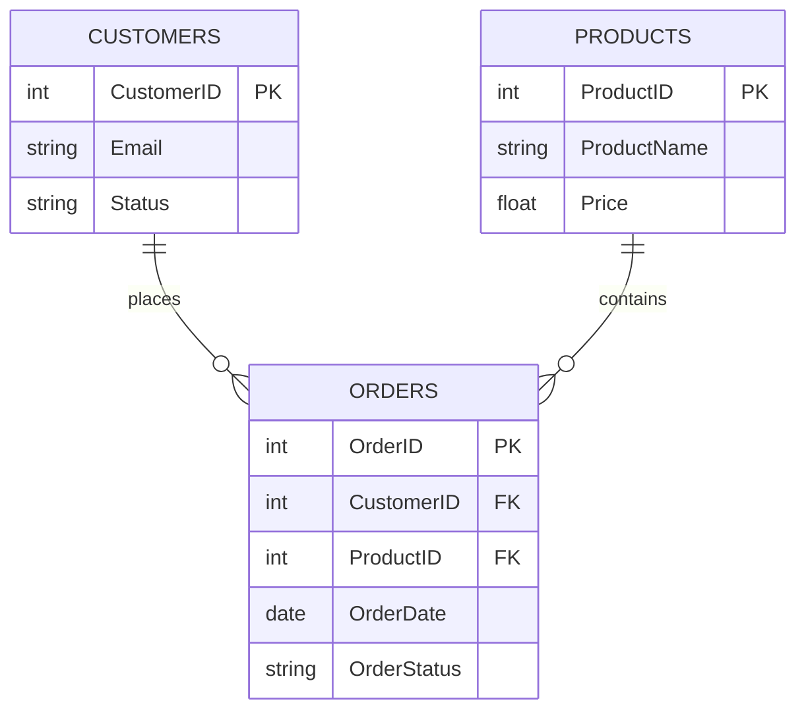

# 🛒 E-Commerce Backend QA Validation (SQL)

## Objective
To validate database integrity, transaction logic, and cross-table relationships for a simulated e-commerce backend using SQL.

## Key QA Checks Performed
* **Orphan Record Identification:** Executed `LEFT JOIN` queries to identify registered users with missing or unlinked order data.
* **Financial Math Validation:** Utilized `SUM()` and `GROUP BY` functions to aggregate and verify total revenue per customer against UI dashboard expectations.
* **Security & Logic Verification:** Authored `INNER JOIN` queries to ensure suspended accounts cannot process completed transactions.

## 🗺️ Database Schema Architecture (ER Diagram)

## Execution & Proof
The database schema, dummy data injection, and QA queries were executed in DB Fiddle.

**[View and Run the Live Code Here]** (https://www.db-fiddle.com/f/efmnkZW6ka3LKLo3rnVeut/2)

### Output Results

